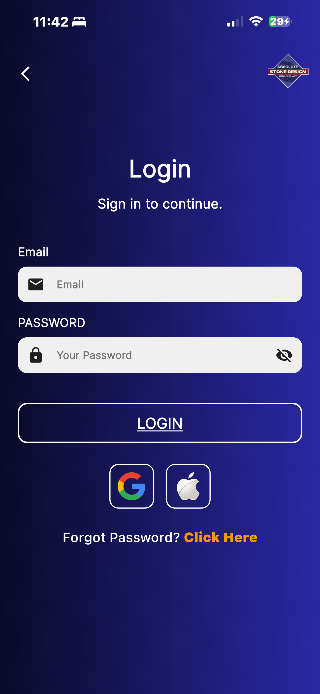
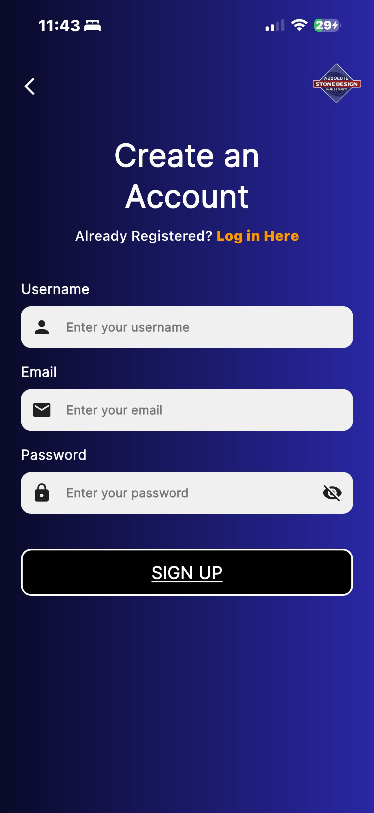
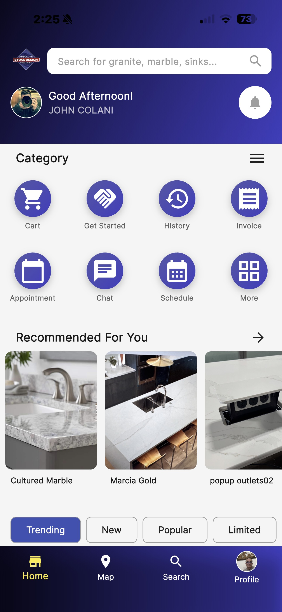
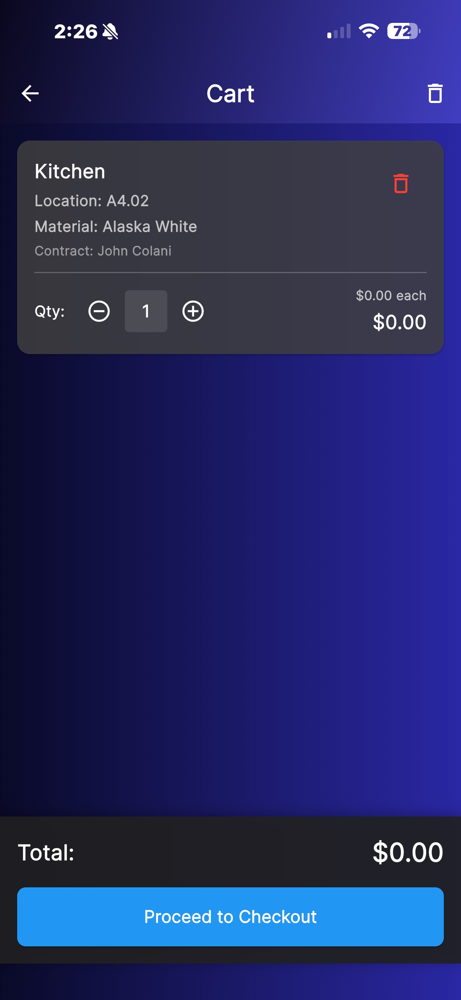
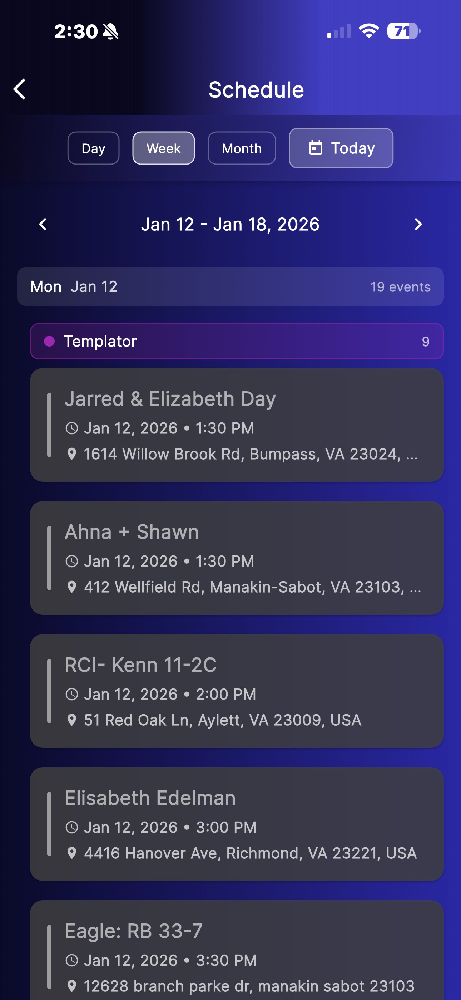
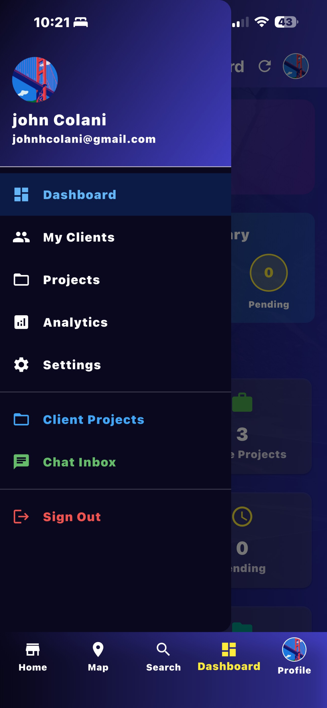
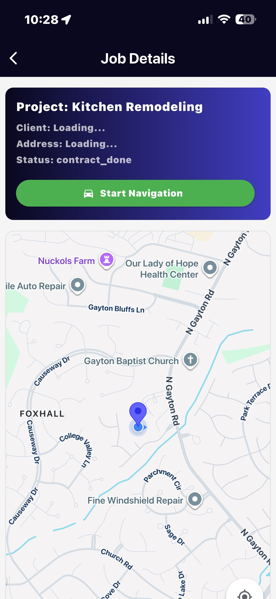
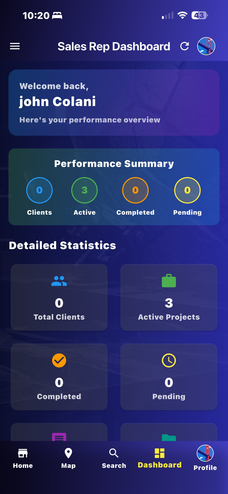
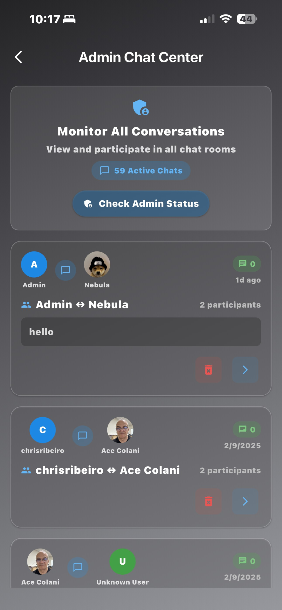

# Absolute Stone Design App - User Guide

Welcome to the Absolute Stone Design app! This guide will help you get started and make the most of the app, whether you're a client, sales representative, installer, scheduler, or administrator.

---

## 📱 Getting Started

### Download the App

- **iOS**: Download from the [App Store](https://apps.apple.com/app/absolute-stone-design)
- **Android**: Download from [Google Play Store](https://play.google.com/store/apps/details?id=com.JohnColani.asdapp)
- **Web**: Visit [absolute-stone-design-app.web.app](https://absolute-stone-design-app.web.app)

### First Time Setup

1. **Open the app** on your device or web browser
2. **Sign up** or **Sign in** using:
   - Email and password
   - Google account
   - Apple ID (iOS only)
3. **Complete your profile** with your information
4. **Start exploring** based on your role below!

---

## 👤 I'm a Client

As a client, you can browse materials, get expert advice, create contracts, and track your installation progress.

### 📸 App Screenshots

#### 🔐 Authorization

  

    
    
Entry Screen

  

  

    
    
Forget Password

  

  

    
    
Login

  

  

    
    
Signup

  

#### 🏠 Home Screen

  

    
    
Google Map

  

  

    
    
Profile

  

  

    
    
Scrolled Home

  

  

    
    
Search Material

  

  

    
    
Home

  

#### 🎯 Category Buttons

  

    
    
Amy Ai Assistant

  

  

    
    
Appointment

  

  

    
    
Book Appointment

  

  

    
    
Cart

  

  

    
    
Chat With Salesrep

  

  

    
    
Get Started

  

  

    
    
Invoice Content

  

  

    
    
Invoice

  

  

    
    
My Project

  

  

    
    
New Contract

  

  

    
    
Pay Invoice

  

  

    
    
Project Tracker

  

  

    
    
Salesrep List

  

  

    
    
Schedule

  

### Key Features

#### 🏠 Browse Materials
- View trending, new, popular, and limited materials
- Search by type, color, finish, or name
- Save favorites for later
- View detailed material information and photos

#### 💬 Chat with Sales Representative
- Get personalized recommendations
- Ask questions about materials
- Share photos and voice messages
- Get instant responses

#### 🤖 Ask Amy (AI Assistant)
- Get instant answers to common questions
- Browse materials with AI recommendations
- 24/7 support for quick inquiries
- View relevant material images

#### 📄 Create & Manage Contracts
- Create digital contracts
- Review and sign electronically
- Download PDF copies
- Track contract status

#### 🔧 Track Installation Progress
- See real-time installation updates
- View installation timeline
- Browse installation photo albums
- Contact installer if needed

### Quick Start Guide

1. **Browse materials** → Tap the **Home** tab
2. **Get help** → Tap **Amy** icon or **Chat** tab
3. **Create contract** → Go to your profile → Contracts
4. **Track installation** → Go to your profile → Installations

### 📖 [Complete Client Guide →](docs/USER_GUIDE.md#-client-guide)

---

## 💼 I'm a Sales Representative

Manage your clients, track projects, and grow your sales with comprehensive tools.

### 📸 App Screenshots

  

### Key Features

#### 📊 Dashboard Overview
- View total clients and active projects
- See recent activity and statistics
- Quick access to common tasks
- Performance metrics

#### 👥 Client Management
- View all assigned clients
- Access client contact information
- Review project history
- Track communication history

#### 💬 Chat Inbox
- Respond to client messages
- Send material recommendations
- Share photos and documents
- Manage multiple conversations

#### 📈 Analytics
- Track sales performance
- View client engagement metrics
- Analyze trends
- Monitor project status

### Quick Start Guide

1. **Check messages** → Tap **Chat** tab or **Inbox**
2. **View clients** → Go to Dashboard → **My Clients**
3. **Create contract** → Client profile → **Create Contract**
4. **View analytics** → Dashboard → **Analytics** tab

### 📖 [Complete Sales Rep Guide →](docs/USER_GUIDE.md#-sales-representative-guide)

---

## 🔧 I'm an Installer

Manage your jobs, update status, upload photos, and keep clients informed.

### 📸 App Screenshots

  

### Key Features

#### 📋 Job Management
- View all assigned jobs
- See job details and client information
- Update job status
- Mark jobs as complete

#### 📍 Location Tracking
- View job locations on map
- Get directions to job sites
- Share your location with clients

#### 📸 Photo Albums
- Upload installation photos
- Organize photos by job
- Share progress with clients

#### ⏰ Availability Status
- Set your availability
- Update status (Available, Busy, Off)
- Manage your schedule

### Quick Start Guide

1. **View jobs** → Dashboard → **My Jobs** tab
2. **Update status** → Tap a job → **Update Status**
3. **Upload photos** → Job details → **Add Photos**
4. **Check map** → **Map** tab to see job locations

### 📖 [Complete Installer Guide →](docs/USER_GUIDE.md#-installer-guide)

---

## 📅 I'm a Scheduler

Manage calendar events, coordinate appointments, and keep everything organized.

### 📸 App Screenshots

  
  

### Key Features

#### 📆 Calendar Dashboard
- View all events in calendar format
- Filter by event type (Templates, Installer, Service, Pickup)
- Color-coded events for easy identification

#### ➕ Create Events
- Create installer appointments
- Schedule service orders
- Add pickup events
- Create reusable templates

#### 🔄 Google Calendar Integration
- Sync with Google Calendar
- View events in both apps
- Automatic synchronization

#### 📋 Event Management
- Edit event details
- View client information
- Reschedule events
- Cancel events when needed

### Quick Start Guide

1. **View calendar** → Open app → Scheduler Dashboard
2. **Create event** → Tap **+** button → Select event type
3. **Filter events** → Use filter buttons at top
4. **Edit event** → Tap on any event to view/edit

### 📖 [Complete Scheduler Guide →](docs/USER_GUIDE.md#-scheduler-guide)

---

## 👨‍💼 I'm an Administrator

Manage the entire platform, users, content, and monitor system performance.

### 📸 App Screenshots

  

### Key Features

#### 👥 User Management
- View all users (clients, sales reps, installers, schedulers)
- Promote users to different roles
- Manage user accounts
- View user activity

#### 📊 Analytics Dashboard
- View comprehensive platform analytics
- Track user growth and engagement
- Monitor system performance
- Generate reports

#### 🤖 Amy AI Management
- Manage knowledge base (Q&A pairs)
- Review conversation logs
- Update AI responses
- Monitor AI performance

#### 📝 Content Management
- Manage materials database
- Update material information
- Add new materials
- Organize material categories

#### ⚙️ Advanced Features
- Advanced analytics with trends and predictions
- Installer workflow management
- AI feedback and performance tracking
- Scheduling automation

### Quick Start Guide

1. **Manage users** → Dashboard → **User Management** tab
2. **View analytics** → Dashboard → **Analytics** tab
3. **Manage Amy** → Drawer menu → **Amy Management**
4. **Advanced features** → Drawer menu → **Advanced Features**

### 📖 [Complete Admin Guide →](docs/USER_GUIDE.md#-admin-guide)

---

## 🌟 Common Features (All Users)

### Profile Management
- Update personal information
- Change profile photo
- Manage account settings
- Update preferences

### Notifications
- Receive push notifications
- Get updates on messages
- Installation status alerts
- Important announcements

### Search
- Search materials by name
- Filter by type, color, finish
- Advanced search options
- Save search preferences

### Map
- View showroom locations
- Find nearby installers
- Get directions
- View business hours

---

## ❓ Need Help?

### Troubleshooting

**Can't sign in?**
- Check your email and password
- Try "Forgot Password" to reset
- Use Google/Apple sign-in if available

**Not receiving notifications?**
- Check app notification settings
- Enable notifications in device settings
- Check internet connection

**App crashes or freezes?**
- Close and reopen the app
- Update to the latest version
- Clear app cache (Android)

**Can't find a feature?**
- Check the menu (☰) for all options
- Use the search function
- Refer to the role-specific guide above

### Contact Support

- **In-app**: Tap **Help** or **Support** in the menu
- **Email**: Contact your sales representative
- **Phone**: Call Absolute Stone Design

---

## 📚 Detailed Documentation

For comprehensive guides with step-by-step instructions, screenshots, and advanced features:

### 📖 [Complete User Guide](docs/USER_GUIDE.md)

This detailed guide includes:
- Step-by-step instructions for each feature
- User journey maps
- Visual guides
- Troubleshooting tips
- Pro tips and best practices

### Quick Links
- [Client Guide](docs/USER_GUIDE.md#-client-guide) - Complete client instructions
- [Sales Rep Guide](docs/USER_GUIDE.md#-sales-representative-guide) - Sales representative tools
- [Installer Guide](docs/USER_GUIDE.md#-installer-guide) - Installer job management
- [Scheduler Guide](docs/USER_GUIDE.md#-scheduler-guide) - Calendar management
- [Admin Guide](docs/USER_GUIDE.md#-admin-guide) - Administrative tools

---

## 🎯 Tips for Success

### For Clients
- 💡 Use Amy AI for quick questions - she's available 24/7!
- 💡 Save favorite materials to compare later
- 💡 Enable notifications to stay updated on your installation
- 💡 Upload photos when chatting with your sales rep for better recommendations

### For Sales Representatives
- 💡 Check your inbox regularly for new client messages
- 💡 Use analytics to identify trends and opportunities
- 💡 Keep client information up-to-date
- 💡 Create contracts promptly after client decisions

### For Installers
- 💡 Update job status regularly to keep clients informed
- 💡 Upload photos throughout the installation process
- 💡 Use the map feature to optimize your route
- 💡 Set your availability status accurately

### For Schedulers
- 💡 Create templates for recurring events
- 💡 Use color-coding to quickly identify event types
- 💡 Sync with Google Calendar for comprehensive scheduling
- 💡 Review calendar daily to avoid conflicts

### For Administrators
- 💡 Review analytics weekly to monitor platform health
- 💡 Update Amy's knowledge base regularly
- 💡 Monitor user activity for issues
- 💡 Use advanced features for deeper insights

---

## 🔄 App Updates

The app is regularly updated with new features and improvements. You'll be notified when updates are available.

**Current Version:** 3.0.17+81

**To update:**
- **iOS**: App Store → Updates
- **Android**: Google Play Store → My apps & games
- **Web**: Refresh your browser (updates are automatic)

---

## 📞 Support & Feedback

We're here to help! If you have questions, feedback, or need assistance:

1. **In-app support**: Use the Help section in the menu
2. **Contact your representative**: For clients, contact your sales rep
3. **Admin support**: For team members, contact your administrator

---

**Last Updated**: January 2026  
**Version**: 3.0.17+81  
**App Maintained by**: Absolute Stone Design Development Team

---

> 💡 **Tip**: Bookmark this page for quick reference! Each role section above has a link to the complete detailed guide.
